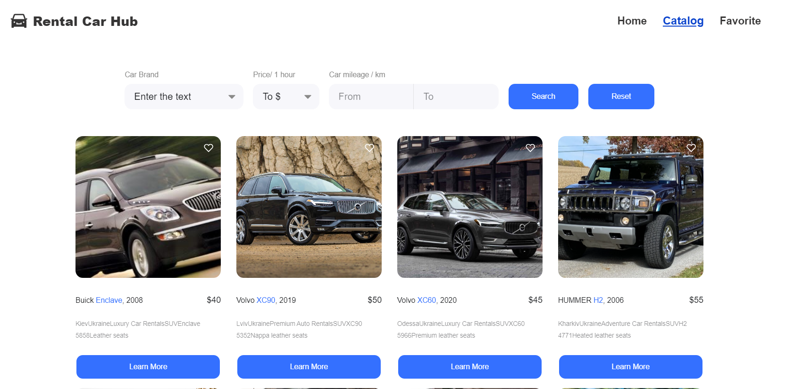

Car Rental Application

Project Overview The Car Rental Application is an online platform designed to
streamline the process of car rental for users. Our aim isto simplify the search
and booking of cars, offering quick and convenient access to rental vehicles.

Installation To get started with the Car Rental Application, follow these steps:

1. Clone the repository: git clone
   https://https://github.com/farfalina1908/car-rental-app
2. Install dependencies: npm install
3. Launch the project: npm start

How to Use Here's how you can utilize our platform:

1. Utilize the search feature to find available cars based on your criteria.
2. Select your desired car and proceed to book it for rental.

Technologies: Frontend: HTML/CSS JavaScript Axios Styled Components React VSCode
Git Redux Toolkit Pagination GitHub React Router

Backend: Mockapi.io

Developer: I created this project to offer users a user-friendly car rental
solution, simplifying the process of finding and booking cars.
